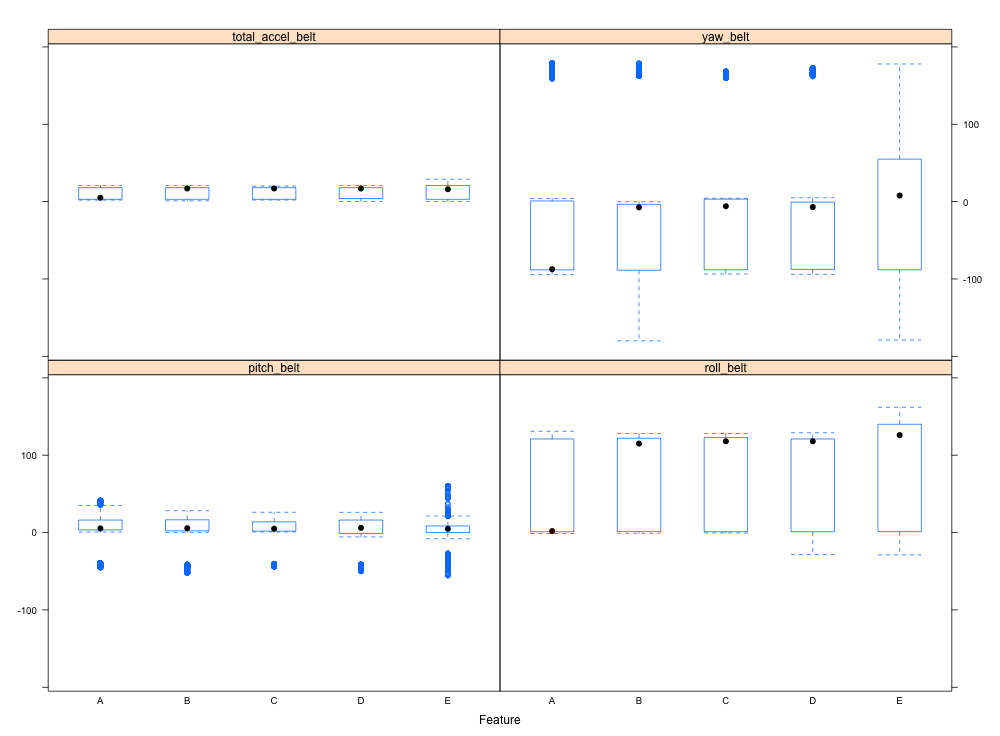

As we all know, this assignment asks us for a model which predicts(more specifically, classify) the pattern of dumbbell exercises the young men are taking well.

First of all,I take an exploratory over the raw data. After importing the csv files, I print the names and dimension of training set. And it goes like this.

`> names(data)`
```
  [1] "X"                        "user_name"                "raw_timestamp_part_1"     "raw_timestamp_part_2"    
  [5] "cvtd_timestamp"           "new_window"               "num_window"               "roll_belt"               
  [9] "pitch_belt"               "yaw_belt"                 "total_accel_belt"         "kurtosis_roll_belt"      
 [13] "kurtosis_picth_belt"      "kurtosis_yaw_belt"        "skewness_roll_belt"       "skewness_roll_belt.1"
 ...  "magnet_dumbbell_z"        "roll_forearm"             "pitch_forearm"            "yaw_forearm"             
[125] "kurtosis_roll_forearm"    "kurtosis_picth_forearm"   "kurtosis_yaw_forearm"     "skewness_roll_forearm"   
[129] "skewness_pitch_forearm"   "skewness_yaw_forearm"     "max_roll_forearm"         "max_picth_forearm" 
```
`> dim(data)`
```
[1] 19622   160
```

These feedback lines show us something valuable. One thing is that the dataset is enormously beyond human manipulation and the other is that colnames show how related they are to our final goal. Among these names, column 1 through column 7 are userInfo, timeInfo etc. We should not implement model on these even if they may deeply correlated with 'classe' cause this kind of relation is of no scientific value. So I just wipe them out from the data frame. Also I wipe a lot columns that contain 'NA' as major content, after which the column num equals 53, decreased from 160.

Then I plot classe versus other attributes. Here is an example:

This lattice illustrates relations between 'classe' and four predictors.

As we can see, data scale is large and will consume a huge amount of time in training progress(And it really does according to experiments). 

Considering that, I think of two ways to speed up the training phase, one is to category the predictors by sensor type('belt', 'arm' etc.) and create new covariates from categories so as to tight data up and reduce computation complexity. The other way is laveraging parallel processing frameworks in R to spread work across multicores. (I took the latter in practice, but the former one is worth trying, if data scales huger.)

Also we can come with the idea that the 'classe' result would have no necessary alrithemtic relation with predictors, since we don't have to do math but measurement to see whether an action, dumbbell lifting is of specification. So I select classification tree(random forest, to be precise) as method in model fitting.

The next procedure is dividing data into training and testing dataset, while the test file in project assignment acts as validation set. Below are the core lines in model fitting. With multicore techique at work, the whole model fitting process runs at seconds, while other routines might take decades.

```
> system.time({
+ registerDoMC(cores= 4)
+ model <-randomForest(training[-ncol(training)], training$classe, ntree=200)
+ })
   user  system elapsed 
 20.714   0.238  21.005 
```

Fit the output model to test dataset, and works really well:

`> confusionMatrix(predict(model, testing), testing$classe)`
```
Confusion Matrix and Statistics

          Reference
Prediction    A    B    C    D    E
         A 1395    2    0    0    0
         B    0  945   10    0    0
         C    0    2  845    8    0
         D    0    0    0  796    0
         E    0    0    0    0  901

Overall Statistics
                                          
               Accuracy : 0.9955          
                 95% CI : (0.9932, 0.9972)
    No Information Rate : 0.2845          
    P-Value [Acc > NIR] : < 2.2e-16       
                                          
                  Kappa : 0.9943          
 Mcnemar's Test P-Value : NA              

Statistics by Class:

                     Class: A Class: B Class: C Class: D Class: E
Sensitivity            1.0000   0.9958   0.9883   0.9900   1.0000
Specificity            0.9994   0.9975   0.9975   1.0000   1.0000
Pos Pred Value         0.9986   0.9895   0.9883   1.0000   1.0000
Neg Pred Value         1.0000   0.9990   0.9975   0.9981   1.0000
Prevalence             0.2845   0.1935   0.1743   0.1639   0.1837
Detection Rate         0.2845   0.1927   0.1723   0.1623   0.1837
Detection Prevalence   0.2849   0.1947   0.1743   0.1623   0.1837
Balanced Accuracy      0.9997   0.9966   0.9929   0.9950   1.0000
```

The final model works fully correctly with validation dataset, according to submission feedback.

That's all.

Thanks twice for ignoring my awkward and "exotic" English :)
